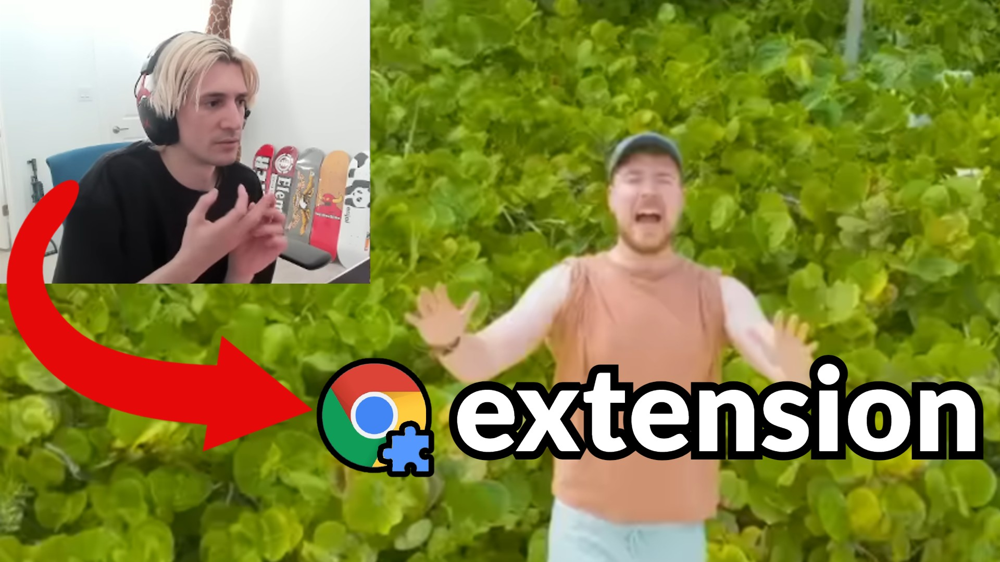

# ThasCrazyChat
AY, CHAT! CHAT! THAT'S CRAZY!

Feeling lonely? Bring the face of streamers on all the videos, rarely with any commentary!

Featuring xQc, Pyrocynical and MoistCr1tikal/penguinz0.

# How to
## Extension
1. Navigate [here](chrome://extensions) (chrome://extensions)
2. Click "Load Unpacked" at the **top left** corner.
3. Select the folder `extension`.
4. Activate the service worker (click the blue text).

## Local server
1. In this directory, type `npm i express cors`.
2. Change the variable inside `index.js` (downloadsPath) to match **YOUR** folder with downloads.
3. Run `node index.js`.
4. Open the extension and type `http://localhost:3000/path_to_your_video.mp4`.
5. Go to YouTube and select a video. You might need to select a second one.

To verify that you have successfully setup the service, navigate to http://localhost:3000/ and check the folder.

# FAQ
## It doesn't work!
It works for me.

## Where do I get the videos?
They're inside `videos`.

## What do I set "downloadsPath" as?
Example: `C:/Users/User/Downloads/thascrazychat/videos`

## Why don't you publish this on Chrome Web Store?
I don't know how and I'm too lazy to do it

## Why are the videos so quiet
Change them and stop complaining, IM TIRED OF CROPPING THEM IN DAVINCI RESOLVE
## Help
No